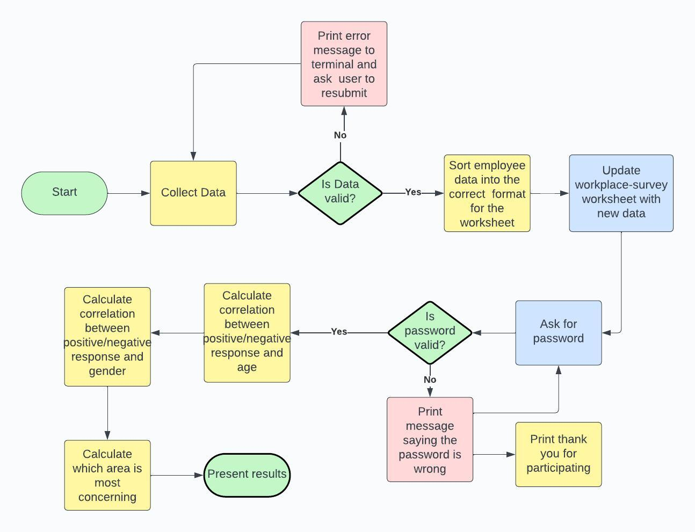

# Work Environment Survey

This survey was developed for a fictional web developer company to improve their work environment. The survey is the employers first step in the process of improving the work environment. They will therefore just look at the physical work environment in the office and in the break room and the social environment overall. This is to be able to identify what part they should focus on first when they start working on improving the work environment along with the employees.

In the survey, the employees are asked to give their age, gender, department they work in and then to respond to three questions using a few words on a scale from terrible to great. The questions concern the physical work environment in the office (where they were asked to consider things such as noise levels, heating, ergonomic set up at the desk, etc.), the physical environment in the break room/lunch room (with similar aspects to consider) and the third question concerns the social environment at work (where the employees were asked to think about things like how the team talked to each other, if there were any discriminatory behavior or language, if you feel like you can ask for help etc.).

[View the work evnironment survey app here](https://workplace-survey-2cd6ac8e8ed6.herokuapp.com/)

## Table of Content
1. [Project Goals](#project-goals)

    a. [User Goals](#user-goals)

    b. [Site Owner Goals](#site-owner-goals)
2. [User Experience](#user-experience)

    a. [Target Audience](#target-audience)

    b. [User Expectations](#user-expectations)
3. [Technical Design](#technical-design)

    a. [Flowchart](#flowchart)
4. [Technologies Used](#technologies-used)

5. [Features](#features)

    a. [Existing Features and Functions](#existing-features-and-functions)

    b. [Future Features](#future-features)
6. [Testing](#testing)

    a. [Validation testing](#validation-testing)

    b. [User testing](#user-testing)
7. [Deployment](#deployment)

8. [Credits](#credits)

9. [Acknowledgments](#acknowledgments)

## Project Goals

### User Goals

The intended user is an employer and their employees who intend to improve both the physical and social work environment at their place of work. For the user, the most important thing is that the survey is clear on what kind of a survey it is, is clear in the instructions and that it is easy to follow. For the user that fills in the survey, it is of importance to be led through the survey in a pedagogical way.

### Site Owner Goals

The site owner in this case is the employer who would like to have some simple data to start improving the work environment at the office. The employer wants some statistics to identify what part they should begin with and some statistics that could give them an idea of whether there might be more complaints in one age or gender group than others so that they can explore why that might be and use it in the improvement work. Therefore, the site owner would like some simple questions for the employees to answer and some calculations of the statistics. 

The site owner does not want all of the staff to get access to the results instantly and therefore asks for the results to be password protected.

## User Experience

The user is met with a welcome message and is told what kind of a survey this is. The survey then moves straight to the first question as this is something the staff of a company is expected to do during their working hours and they might not want to spend too much time on it. So the survey is quite concise and efficient.

Whilst the survey is quite efficient, it also keeps a polite and pedagogical tone throughout to make sure the users are not stressed by not understanding or by pressure to think of long winded answers. Instead, they can think about each question and choose one of the options given.

If the user enters an answer that is not one of the options given, that are told directly that the only valid data are the answer options provided. This minimizes confusion on why the answer was not accepted.

The survey ends with some reassurance that this is only the beginning of the improvement of work environment and that they will work more with this in meetings and they will also be presented some of the results from the survey. This is a reassurance for the user to try and prevent that they get frustrated by the results being password protected or by how short and basic the survey is.

For the employer, who is also a user of sorts, the collected data is presented in a clear way that shows percentages of negative answers since the unhappiness about the work environment is what the employer is interested in. The data that shows percentages of negative answers about each area of the work environment is presented in a sorted list from the highest percentage of negative answers to the lowest. The decision to show each area, and not just the one with the highest percentage as the most urgent area to work with, was made so that the employer/admin staff can see the nuances and decide for themselves what area is most urgent. This is because statistics cannot replace the human factor when it comes to questions like work environment.

## Technical Design

The flowchart below was used as the foundation for the technical build of the survey.

### Flowchart

## Technologies Used

Language: 
- Python

Frameworks and Tools:
- [Git](https://git-scm.com/) used  for version control.(`git init` used to create a git repository)
- [GitHub](https://github.com/e-tidemo/workplace-survey) used as online repository for secure storage (`git add`, `git commit`, `git push` were used to save and push continuously to the GitHub repository)
- [Heroku](https://dashboard.heroku.com/apps) for deployment of the project and storage of the password

Imported Libraries:
- `gspread` - The app uses gspread library to interact with Google Sheets where the data from the survey is sorted and stored.
- `os` - The app uses os to access and modify environment variables (`os.environ`).
- `pandas` - The app uses pandas for data selection and indexing and for data analysis.
- `from operator import itemgetter` imports the itemgetter function from the operator module in Python. In the app, this is used to sort data from highest percentage to lowest.

APIs:
- Google Drive Google Sheet

## Features

### Existing Features and Functions

- Welcome to the survey:
   The first thing that comes up as you start running the program is a welcome and an explanation of what the survey is about as well as a message for the user to take their time filling it out.

- Question inputs:
   The second thing that happens is that the user is presented with five questions along with some instructions. The user is prompted to answer the questions as truthfully as possible.

   If the answer to the question is not one of the given options, the user is told that the data is invalid and is prompted to submit a new answer:

- Password:
   Once the questions are answered, the user is prompted to submit the password needed to review the results. This is a feature to limit the information from the survey to a few selected people in the admin staff. The password is "admin" and any incorrect submits generate a statement telling the user the password is incorrect, to try again or to leave the survey as they are reassured that the topic of the survey will be brought up again later.

   If the password is incorrect, the user is told that the data is invalid:

- Results:
   As one passes the correct password to the input field, the user is presented with a percentage of the amount of negative answers for six age groups and three gender groups. This can then be used for analysis on correlations between age/gender and negative opinions on the work environment.
   This is also followed by results showing how many percent of the answers to the questions were negative in each area of the work environment. This list is ordered from the highest percentage of negative answers to the lowest to give the employer an idea of what area is most urgent to adress according to the employees.

### Future Features

In the future, the user experience could be improved by showing only one part of the survey at a time instead of keeping everything in as you go along.

## Testing

### Validation Testing

The app was put through the PEP8 Python Linter provided by Code Institute with some small remarks about the length of some of the lines. Most of the lines were shortened as a result of the linter's output but some could not be shortened.

There were no other problems stated.

The app was also puth through a lighthouse testing:

### Features Testing

| Questions input |Result  |
|--|--|
|Run the program and enter one of the options given (department, gender, terrible-great).| Pass |
|Verify that the program accepts valid inputs (e.g. terrible, bad, needs improvement, good, great) and rejects invalid inputs.| Pass|
|Keep looping the program until a valid input is provided.|Pass|

| Age question input |Result  |
|--|--|
|Run the program and enter age.| Pass |
|Verify that the program accepts valid inputs (ages between 18 and 70) and rejects invalid inputs.| Pass|
|Keep looping the program until a valid input is provided.|Pass|

| Password |Result  |
|--|--|
|Enter a password.| Pass |
|Verify that the program only accepts one valid password.| Pass|
|Keep looping the program until the correct password is provided.|Pass|

| Results shown |Result  |
|--|--|
|Show the results of negative answers in different age groups, gender groups and different areas of work environment| Pass |
|Sort the areas of work environment from the one with highest percentage of negative responses to the lowest| Pass|

## Deployment

1. Set up Google Cloud Project:
I set up a Google Cloud project in the [Google Cloud Console](https://console.cloud.google.com/welcome?project=workplace-survey) and created a project named "workplace survey". I then enabled Google Sheet and Google Drive APIs to be able to use Google Sheets for my survey data.

Within the Google Cloud Console, I also vreated credentials by going to "APIs & Services > Credentials" and clicking "create credentials" and choosing "service account key". I then created a new service account wit the Editor rolse and created a key in JSON format and download said JSON file with credentials the application needs to access the Google Cloud Services.

2. Deploy to Heroku:
The application was deployed to Heroku by following these steps:

- Make a list of requirements in a requirements.txt-file by typing ”pip3 freeze >requirements.txt” into the terminal. This saves any libraries that need to be installed to the project files in Heroku.
- Login to Heroku (or create an account)
- Select "Create new app"
- Give the app a name and choose your region
- Go to the "settings" tab and add the Python build pack and then the node.js build pack.
- Create a "config VAR" with the key of CREDS and value the content of the creds.json file that was created in the Google Cloud Console.
- Create a second "config VAR" with the key "ADMIN" and the value "admin" which is the password to show the results in the app. This way, the password is stored securely.
- Go to the "Deploy" tab and choose GitHub as a deployment method.
- Search for the right GitHub repository to connect to.
- Choose "enable automatic deploys" and then deploy branch.
- Wait until the app is built and then click on the "View" link.

3. To run locally:
- Once logged into GitHub, click on repository to download.
- Select **Code** and click "download the zip file".
- Extract the zip file and use it in your local environment.

You can also **Clone** or **Fork** this repository in your own GitHub account.

## Credits

The code for age group definitions are from [Towardsdatascience](https://towardsdatascience.com/cleaning-analyzing-and-visualizing-survey-data-in-python-42747a13c713)
Instructions on how to get the survey data into Python were taken from [Dataquest](https://www.dataquest.io/blog/how-to-analyze-survey-data-python-beginner/)

## Acknowledgments

I would like to direct a huge thank you to my mentor, Spencer Barriball, who has shown great patience with me and who has offered some great help to me, not least when I was struggling a bit with the deployment.